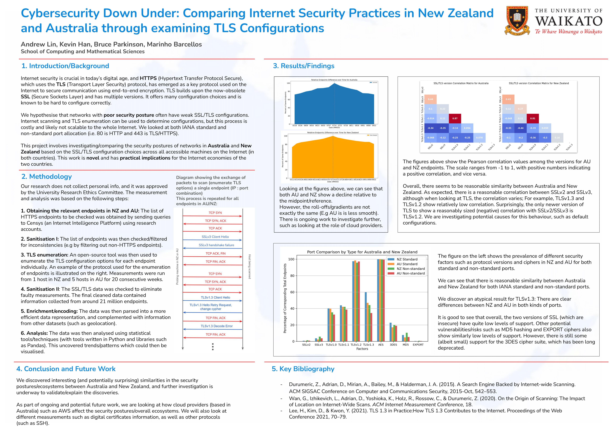

## Overview
This repository contains the graphs and scripts that I produced/were used during my Summer Research Project over the 2023-2024 summer break.
 
Other files/folders (E.g sample data) are stored locally on my machine.    
 
## About the project
The Summer Research project was focused on Cybersecurity, and it was done as part of a 10-week scholarship over the aforementioned summer break.
It involved analysing network security in New Zealand and Australia using internet scanning and the Python programming language (and associated data analysis libraries such as Pandas).
 
 
For more information about the project, see the file **"researchprojectabstract.pdf"** located in the repository.
 
 
The poster (which was a major deliverable) produced at the end of the programme/project can be viewed below:  

    
 
 
## NOTE/DISCLAIMER
ChatGPT (GPT-4) was used during the course of this project/research
